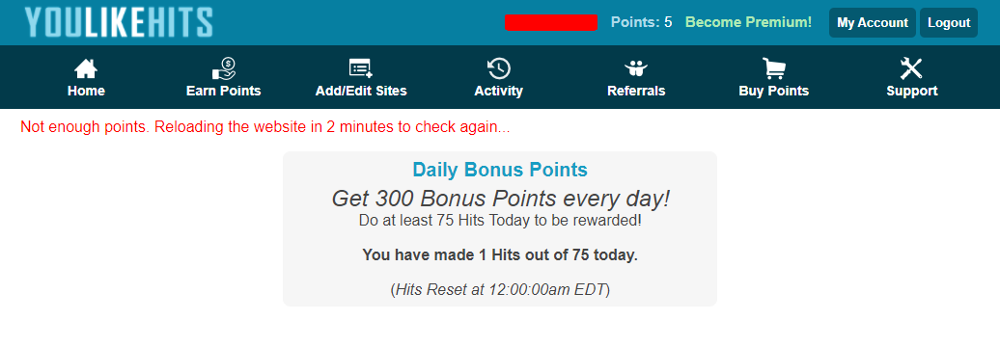
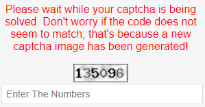
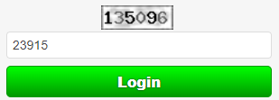

# YouLikeHits Bot - Userscript for YouLikeHits
## Features
**Just navigate to each of these sections (with one dedicated browser tab each) in order to launch the bot.**
#### Website Section
* automatic clicks on links
* closing of opened tabs if their points were successfully awarded
* automatic reloading in various cases e.g. all links were clicked, internal server error, link ran out of points etc.

#### YouTube View Section
* captcha solving (applicable to further sections)
* automatic clicks on the "view" button

#### Login Form
* captcha solving (no further automation planned here!)

#### Daily Bonus Points Section
* page refreshing until the claim button appears
* claiming as soon as the button appears
  

**Disclaimer: Usage of this inofficial script does eventually not violate the Terms of Service(T.O.S.) of *YouLikeHits.com*, but it may at any given time if the T.O.S. are updated. There is neither any warranty for the functionality of this script nor any liability for a certain level of security. Use it at your own risk.**

## Installation
1. make sure to have [Tampermonkey/Greasemonkey/Violentmonkey](https://gist.github.com/gekkedev/492e1b541ea3dd2cd8fbcc358fd224af) installed
1. click [here](https://raw.githubusercontent.com/gekkedev/youlikehitsbot/master/youlikehitsbot.user.js)
1. confirm your intention to install the Userscript.

By default, the script will automatically update every 24 hours (at least in Tampermonkey). If an updated version ever requires additional permissions, you will be asked to confirm this before the updated version gets installed.

### Captcha Solving
Just let it run, it should work nicely at all times. If not, you may still enter the captcha manually.  
Before/while solving:  
  
  
After solving:  

## Features to come in future
* coverage of more sections
* toggle buttons for each section
